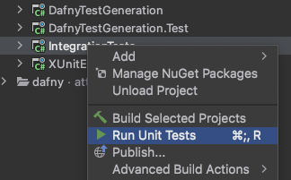
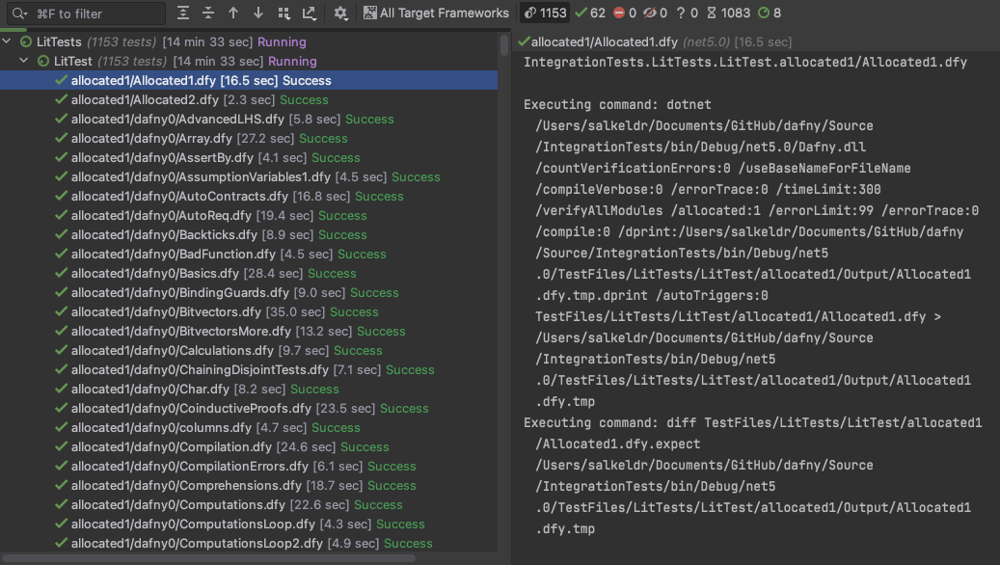

# Dafny Integration Tests

The tests in this directory are run using the [IntegrationTests](../Source/IntegrationTests) project,
which uses the xUnit-based LIT test runner from the [XUnitExtensions](../XUnitExtensions) package 
rather than the LLVM `lit` CLI.

## Executing Tests from the Command Line

The xUnit LIT test interpreter is run through xUnit `Theory` parameterized tests, and therefore
hooks into the general-purpose `dotnet test` command:

```
dotnet test -v:n Source/IntegrationTests
```

`-v:n` is optional, and increases the default logging verbosity so that you can see individual tests as the pass.

The file path of each test file, relative to the `Test` directory, is used as the display name of its corresponding test.
This means you can use the `--filter` option to run a subset of tests, or even a single file:

```
dotnet test -v:n Source/IntegrationTests --filter DisplayName~comp/Hello.dfy
```

[See here](https://docs.microsoft.com/en-us/dotnet/core/tools/dotnet-test) for more information about
the `dotnet test` command and other supported options.

## Executing Tests from JetBrains Rider

You will likely find it more convenient to run tests from an IDE such as
[JetBrains Rider](https://github.com/dafny-lang/dafny/wiki/JetBrains-Rider-FAQ).

Assuming you have loaded the `Dafny.sln` solution in Rider, you can execute all the integration tests
by right-clicking on the `IntegrationTests` package and selecting `Run Unit Tests`.



You will see a tree of running tests and their results, with lots of options for filtering and summarizing results.
Note the search window in the top-left, which can be used to filter to tests matching a particular substring.



Once you have at least started running these tests at least once and this tree has been populated, you can right-click any
individual test to execute it, or similarly any subset of selected tests. You will often want to start the test suite and then
immediately cancel it just to populate the tree for this purpose.

## Debugging Tests

The xUnit test runner supports executing commands such as `%dafny` by directly invoking the main entry point
of the corresponding C# package (i.e. [`DafnyDriver`](../DafnyDriver)), which makes running the debugger against
a particular test much more convenient. By default this is disabled and the runner creates a separate dafny process
just as lit does, however. This is because the main CLI implementation currently has shared static state, which
causes errors when invoking the CLI in the same process on multiple inputs in sequence, much less in parallel.
Future changes will address this so that the in-process Main invocation can be used instead, however,
which will likely improve performance but more importantly allow us to measure code coverage of the test suite.

To debug a single test, change the value of the `InvokeMainMethodsDirectly` boolean constant in the
[LitTests class](../IntegrationTests/ListTests.cs) to `true`, and then right-click the test you wish to debug and select
`Debug Selected Unit Tests`. You will see exception if the test you are running makes multiple calls to commands like `%dafny`,
so you may wish to remove the calls you are not interested in first, e.g. if you are debugging an issue with a specific compiler.
